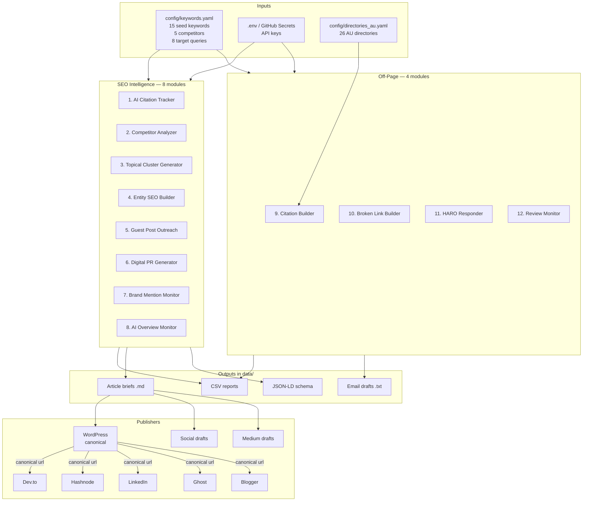
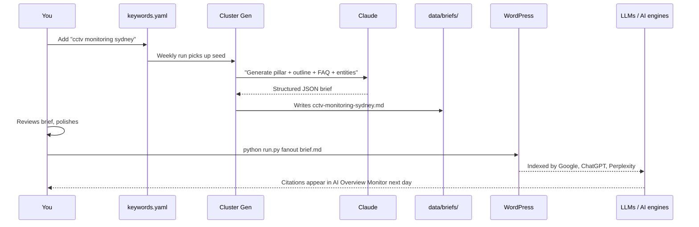

# Live Roadmap — securityblogs.com.au SEO Bot

> A visual map of every module, what it does, when it runs, and where its
> output lands. For real-time state, run `python seo-bot/run.py status`.

## 1. Current build status

```mermaid
graph LR
    A[✅ 12 SEO modules built] --> B[✅ 9 publishers built]
    B --> C[✅ Daily + weekly workflows]
    C --> D[✅ GitHub Actions wired]
    D --> E[⏳ ANTHROPIC_API_KEY secret]
    E --> F[⏳ First test run]
    F --> G[⏳ NAP details in keywords.yaml]
    G --> H[⏳ WordPress credentials]
    H --> I[🎯 Bot fully operational]

    style A fill:#22c55e,color:#fff
    style B fill:#22c55e,color:#fff
    style C fill:#22c55e,color:#fff
    style D fill:#22c55e,color:#fff
    style E fill:#fbbf24
    style F fill:#fbbf24
    style G fill:#fbbf24
    style H fill:#fbbf24
    style I fill:#3b82f6,color:#fff
```



## 2. System architecture



## 3. Schedule timeline

```mermaid
gantt
    title When each module runs (UTC)
    dateFormat HH:mm
    axisFormat %H:%M

    section Daily 06:00 UTC
    AI Citation Tracker     :daily1, 06:00, 2m
    Brand Mention Monitor   :daily2, after daily1, 2m
    AI Overview Monitor     :daily3, after daily2, 2m
    HARO Responder          :daily4, after daily3, 3m
    Review Monitor          :daily5, after daily4, 2m

    section Weekly Mon 19:00 UTC
    Competitor Analyzer     :wk1, 19:00, 5m
    Topical Cluster Gen     :wk2, after wk1, 8m
    Entity SEO Builder      :wk3, after wk2, 2m
    Guest Post Outreach     :wk4, after wk3, 6m
    Digital PR Generator    :wk5, after wk4, 3m
    Citation Builder        :wk6, after wk5, 4m
    Broken Link Builder     :wk7, after wk6, 10m
```



In Sydney time:
- **Daily** runs at **16:00 AEST** (17:00 AEDT during daylight saving)
- **Weekly** runs **Tuesday 05:00 AEST** (06:00 AEDT)

## 4. The full data flow — "seed keyword → published article"



## 5. Setup status board

Check these off as you go. Use `python seo-bot/run.py status` for live state.

### Required to start
- [ ] `ANTHROPIC_API_KEY` added to GitHub Secrets
- [ ] First workflow run completes green
- [ ] Real NAP filled in `config/keywords.yaml` → `entities.organization`

### Required for publishing
- [ ] `WORDPRESS_URL` secret
- [ ] `WORDPRESS_USER` secret
- [ ] `WORDPRESS_APP_PASSWORD` secret (generate at WP Admin → Users → Profile → Application Passwords)

### High-ROI optional (free)
- [ ] `DEVTO_API_KEY` — auto-amplify articles to Dev.to
- [ ] `HASHNODE_API_KEY` + `HASHNODE_PUBLICATION_ID` — auto-amplify to Hashnode
- [ ] `GOOGLE_PLACES_API_KEY` + `GOOGLE_PLACE_ID` — review monitoring
- [ ] `LINKEDIN_ACCESS_TOKEN` + `LINKEDIN_AUTHOR_URN` — LinkedIn posts

### Paid (only after the above is humming)
- [ ] `SERPAPI_KEY` (~US$75/mo) — proper Google AI Overview tracking
- [ ] `AHREFS_API_KEY` (~US$129/mo) — real backlink data for broken-link builder
- [ ] `PERPLEXITY_API_KEY` (pay-as-you-go) — higher-fidelity citation tracking

## 6. Where outputs land

| Output | Path | Generated by |
|--------|------|--------------|
| CSV reports | `data/*.csv` | Every module |
| Article briefs | `data/briefs/*.md` | Topical Cluster Generator |
| JSON-LD schema | `data/schema/*.json` | Entity SEO Builder |
| Email drafts | `data/emails/*.txt` | Outreach + Broken Links + HARO + Reviews |
| Social drafts | `data/social_drafts/*.md` | Social publisher |
| Medium drafts | `data/medium_drafts/*.md` | Medium publisher |
| Citation packet | `data/citation_packet.md` | Citation Builder |
| AI Overview history | `data/ai_overview_history.csv` (append-only) | AI Overview Monitor |
| Run log | `data/seo-bot.log` | All modules |

When run via GitHub Actions, the entire `data/` folder is uploaded as the
`seo-bot-output-<run-id>` artifact (30-day retention).

## 7. One-command commands

```bash
python run.py status      # live state check (modules, secrets, last run)
python run.py list        # all available commands
python run.py daily       # quick monitoring run
python run.py weekly      # full strategic run
python run.py all         # daily + weekly
python run.py fanout data/briefs/<file>.md   # publish everywhere
```

## 8. What's intentionally NOT built (and why)

| Asked for | Built as | Why not full auto |
|-----------|----------|-------------------|
| Auto-post to LinkedIn / X / Reddit | Draft queue | Platform ToS bans unattended posting; accounts get banned |
| Auto-submit to all AU directories | Submission packet + queue | Directories CAPTCHA + IP-rate-limit; need BrightLocal (~US$30/mo) or Yext (~US$500/mo) to bypass cleanly |
| Auto-send HARO/journalist pitches | Drafted, you send | Journalists detect & blacklist AI-spam |
| PBN / auto-backlink / comment spam | Not built | Google spam updates penalise sites that use these — usually permanently |
